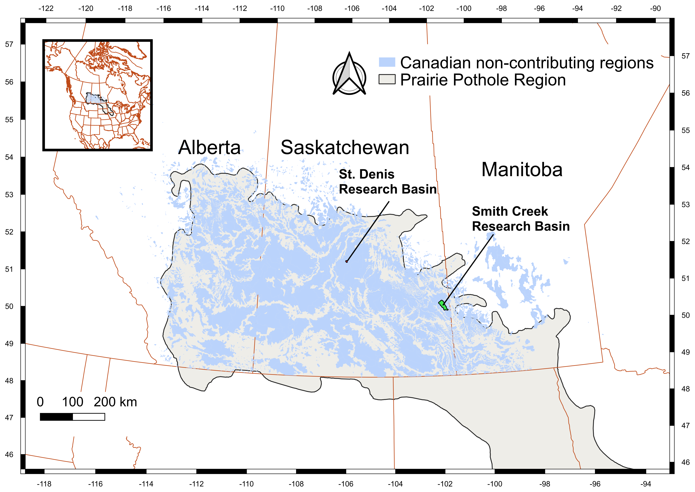
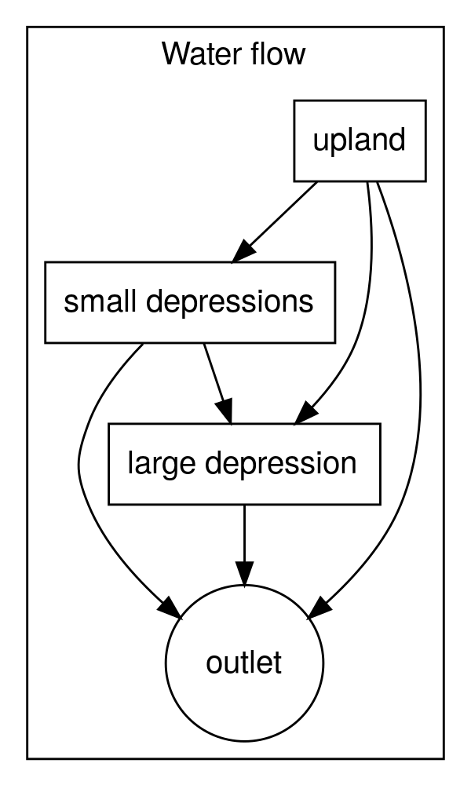

```{r echo=FALSE}
# Some recommended settings. 
knitr::opts_chunk$set(
  echo = FALSE,
  fig.pos = 'h',
  out.extra = "",   # To force the use of figure enviroment
  fig.cap = "Please caption every figure"
)
```

```{r setup, include=FALSE}
library(knitr)
# output <- opts_knit$get("rmarkdown.pandoc.to")
# if (output == "pdf") opts_chunk$set(fig.width = 5, fig.height = 4)
# if (output == "docx") opts_chunk$set(fig.width = 6, fig.height = 4)
library(captioner)
library(kableExtra)
library(pixiedust)
library(flextable)
library(cowplot)
library(flextable)
fig_nums <- captioner()
table_nums <- captioner(prefix = "Table")

# Some recommended settings. 
knitr::opts_chunk$set(
  echo = FALSE,
  fig.pos = 'h',
  out.extra = "",   # To force the use of figure enviroment
  fig.cap = "Please caption every figure"
)
```

```{r keypoints_check, echo=FALSE, results='asis', eval = TRUE}
# This chunk adds a warning if any keypoint is longer than 100 characters. 
# To disable it, you can remove it or set eval to FALSE.
if (any(nchar(rmarkdown::metadata$keypoints) > 100)) {
  cat("\\textcolor{red}{\\textbf{Warning}: keypoint(s)", 
      knitr::combine_words(which(nchar(rmarkdown::metadata$keypoints) > 100)), 
      "longer than 100 characters.}")
}
```

<!-- set up figure and table captions -->

```{r, include=FALSE}
main_map_cap <- "Canadian Prairie ecozone (in black), non-effective regions (in blue), St. Denis Basins and Smith Creek Research Basin. Projection is UTM 13."
fig_nums(name = "main_map", caption = main_map_cap)
main_map_ref <- fig_nums("main_map", display = "cite" )
if (knitr::pandoc_to("docx"))
  main_map_cap <- paste(main_map_ref, ". ", 
                        main_map_cap, sep = "")

PDMROF_cap <- "PDMROF contributing fraction vs. fractional volume for
varying values of b"
fig_nums(name = "PDMROF", caption = PDMROF_cap)
PDMROF_ref <- fig_nums("PDMROF", display = "cite" )
if (knitr::pandoc_to("docx"))
  PDMROF_cap <- paste(PDMROF_ref, ". ", 
                      PDMROF_cap, sep = "")

basin_schematic_cap <- "Schematic diagram of HGDM basin. Gray areas are dominated by
small depressions, white areas have no small depressions."
fig_nums(name = "basin_schematic", caption = basin_schematic_cap)
basin_schematic_ref <- fig_nums("basin_schematic", display = "cite")
if (knitr::pandoc_to("docx"))
  basin_schematic_cap <- paste(basin_schematic_ref, ". ", 
                               basin_schematic_cap, sep = "")

landscape_units_cap <- "Diagram of flows among HGDM landscape units."
fig_nums(name = "landscape_units", caption = landscape_units_cap)
landscape_units_ref <- fig_nums("landscape_units", display = "cite")
if (knitr::pandoc_to("docx"))
  landscape_units_cap <- paste(landscape_units_ref, ". ", 
                               landscape_units_cap, sep = "")

copula_contrib_frac_cap <- "Connected/contributing fractions vs. fractional volume for 10,000 realizations of 1,000 depressions. The realizations are plotted in gray, the median of all realizations is plotted as the heavy black line. A 1:1 line is plotted in red."
fig_nums(name = "copula_contrib_frac", caption = copula_contrib_frac_cap)
copula_contrib_frac_ref <- fig_nums("copula_contrib_frac", display = "cite")
if (knitr::pandoc_to("docx"))
  copula_contrib_frac_cap <- paste(copula_contrib_frac_ref, ". ", 
                                   copula_contrib_frac_cap, sep = "")

hysteretic_model_cap <- "Operation of the parametric hysteresis model of the states of Prairie
basins. The original state is shown at point a. Points b through d show the effects of
removing, then adding water. All states exist below the 1:1 line plotted in red."
fig_nums(name = "hysteretic_model_frac", caption = hysteretic_model_cap)
hysteretic_model_ref <- fig_nums("hysteretic_model_frac", display = "cite")
if (knitr::pandoc_to("docx"))
  hysteretic_model_cap <- paste(hysteretic_model_ref, ". ", 
                                hysteretic_model_cap, sep = "")

copula_area_frac_cap <- "Fraction water cover vs. fractional volume for 10,000 realizations of 1,000 depressions. The median rising limb is plotted in blue, the median falling limb is plotted in red. Curves
for a single depression, based on the Hayashi-van der Kamp equations are plotted in green, 
for p = 3.33, and purple for p = 1.72"
fig_nums(name = "copula_area_frac", caption = copula_area_frac_cap)
copula_area_frac_ref <- fig_nums("copula_area_frac", display = "cite")
if (knitr::pandoc_to("docx"))
  copula_area_frac_cap <- paste(copula_area_frac_ref, ". ", 
                                copula_area_frac_cap, sep = "")

```

# Introduction

The Prairie Pothole Region (PPR) of western North America, including the
Canadian Prairies, is a characterized by its unusual topgraphy. The
location of the region is mapped in `r main_map_ref`. This region is
recently (\~10,000 years B.P.) post-glacial
[@christiansenWisconsinanDeglaciationSouthern1979], and remarkably flat
as a result. The climate of the region ranges from semi-arid to
sub-humid. Therefore, there has not been sufficient time, energy or
water to carve conventional dendritic drainage networks in many
locations.

```{r, echo=FALSE, fig.cap=main_map_cap, out.width="100%"}
  
```

Instead, much of the region is covered with depressions (known locally
as "potholes" or "sloughs") which can intercept runoff. In many parts of
the region, the surface is underlain with thick deposits of glacial till
[@christiansenWisconsinanDeglaciationSouthern1979], which is largely
impermeable.

Unusually, the fractions of many basins in the PPR which are able to
contribute flows to the outlet are dynamic, and change with the state of
storage of water within each basin
[@stichlingDRAINAGEAREAHYDROLOGIC1957]. When a depression is filled with
water, any further addition of water, though direct precipitation, or
intercepted surface runoff, will cause overland flows, through the
process known as "fill and spill", which was first denoted for lakes in
the Canadian Boreal Shield [@spenceHydrologySubarcticCanadian2003].
Where there is a filled path to a drainage channel, overland flows may
contribute flow to the basin outlet.

`r main_map_ref` plots in blue the regions which are denoted as being
"non-effective", i.e. which contribute flow to a stream channel less
than one year in two.

## Modelling connected/contributing fractions

The variable connected (having a path to the outlet) and contributing
(having water flowing to the outlet) fractions of prairie basins are
challenging to model, and are not able to be simulated by the vast
majority of hydrological models. Several methods have been developed,
which have been used by models specific to this region. However, all of
the existing models of the variable connected/contributing fractions of
prairie basins have significant disadvantages that have limited their
successful incorporation in hydrological models.

### Parametric model

The model PDMROF was developed ....

`r PDMROF_cap`

```{r, echo=FALSE, fig.cap=PDMROF_cap, out.width="50%"}
  knitr::include_graphics("figures/PDMROFtest.pdf")
```

### Discrete depression models

The Pothole Cascade Model (PCM) models the storage of water in discrete
storages. The PCM uses the scaling relationships between the depression
water depth (h), and area (A~w~) as defined by
@hayashiSimpleEquationsRepresent2000 in Eq. 1:

$$
A_w = s h ^ {2/p}, (1)
$$

where s and p are constants.

The relationships between the area of the a given depression (A~d~), and
the area of its carchment (the region draining directly to the
depression) (A~c~) have been shown to be well represented by power
functions for depressions (including lakes) in the Canadian Prairies
[@shookStorageDynamicsSimulations2013],as shown in Eq. 2:

$$
A_{c} = a A_d ^b, (2)
$$

where a and b are constants.

Because b \< 1, the catchments of large depressions are relatively
smaller than those of small depressions.

These relationships are also incorporated

The PCM has been incorporated in CRHM (Cold Region Hydrologicalm
Modelling platform) models of the Canadian Prairies, where it
contributed to improved modelling of Prairie basins
[@pomeroyImprovingTestingPrairie2014].

### DEM-based models

Several hydraulic models redistribute direct precipitation and runoff
over a Digital Elevation Model (DEM) of a basin, including WDPM
[@shookWDPMWetlandPonding2021], PRIMA
[@ahmedImprovingRepresentationNoncontributing2021] and FlowFill
[@callaghanComputingWaterFlow2019]. Although the algorithms used by the
models differ, all of the models are iterative and are too
computationally expensive to be used successfully as components of
hydrological models. However, these models are very useful for modelling
the spatial distribution of water on prairie landscapes, and can be used
to validate the model results against remote sensing
[@shookStorageDynamicsSimulations2013,
@armstrongUSINGWETLANDPONDING2013a]. These models can also be used for
developing simpler, more conceptual models which are less conceptually
expensive.

DEM-based models require high resolution data (LiDAR) which is does not
exist in many regions in the Canadian Prairies. Where DEM data is
available, it may require a great deal of pre-processing to be useful,
including burning in culverts and bridges.

## Need for a new type of model

As discussed above, the DEM-based models are too computationally
expensive to be incorporated in hydrological models. However, all of the
existing model types have severe disadvantages which restrict their
utilities.

The Canadian Prairies have experienced historical and ongoing drainage
of the surface depressions in many locations
[@dumanskiHydrologicalRegimeChanges2015]. It is very necessary for
models to be able to simulate the effects of drainage, or addition of
storage. Parametric models, such as PDMROF cannot easily do this,
because their parameters are calibrated, and are specified at basin
scales. DEM-based models, such as WDPM, can incorporate changes in
storage, but this requires modification to the basin DEM, which can be
very difficult and time consuming. Changing the storage in individual
depressions, as used by PCM, is much more feasible.

However, PCM cannot simulate the aggregation and disaggregation of water
bodies as depressions fill and empty. Adding many depressions to a model
increases its complexity, as well as the execution time. In practice,
models are unable to simulate the many thousands of depressions present
in a real basin. @pomeroyImprovingTestingPrairie2014 solved this problem
by using a small set of depressions to statistically represent all the
depressions within a basin, and upscaling the calculated stream
discharge, accordingly. Although this method did work,
@shookQuantifyingEffectsPrairie2021 demonstrated that the quality of the
simulation is adversely affected by using small numbers of simulated
depressions.

One of the most important findings of
@shookQuantifyingEffectsPrairie2021, was that the relationship between
the connected/contributing fraction of a depression-dominated prairie
basin, and the fraction of depressional storage is hysteretic. The
hysteresis was shown to arise from two causes:

1.  The frequency distribution of water ponded areas is non-reversible,
    changing differently when water is added to and removed from surface
    storage. This is related to the differing areas affected by
    evaporation (the area of a given pond) and runoff (the basin of a
    given pond). Therefore the shape of the rising limb will depend on
    the initial state of storage of water.
2.  Because evaporation affects all ponds very similarly, the water
    levels of all the ponds in a basin will be reduced to below their
    sill elevation (the elevation at which spilling can occur)
    simultaneously with the onset of evaporation. Thus the
    connected/contributing fraction of a basin will drop to zero with
    the advent of evaporation.

The WDPM and PCM were demonstrated to display very similar hysteretic
relationships between water storage and connected/contributing
fractions. Because it uses a single-valued function, PDMROF cannot
produce hysteresis in these relationships.

Other important findings of @shookQuantifyingEffectsPrairie2021 related
to the phenomenon of gatekeeping, whereby large depressions prevent the
regions upstream from contrinuting flows downstream untill they are
filled. The term was coined for lakes in the Canadian Boreal shield
[@phillipsConnectivityRunoffDynamics2011], but also applies to
depressions in the Prairies.

Through many Monte-Carlo simulations,
@shookQuantifyingEffectsPrairie2021 demonstrated that where the area of
the largest depression was only a small fraction (\< 2%) of the total
depressional area, the gatekeeping of the largest depression is
negligible. However, when the largest depression is larger, its location
within the basin is important, as it gatekeeps the fraction of the basin
upstream.

## Research objectives

The overall objective of this research is to develop and test a new
method for simulating the variable connected/contributing fractions of
Prairie basins. The method is to have the following characteristics

1.  It must be generic, able to estimate the connected/contributing
    fraction for any Prairie basin.

2.  It must be able to simulate the hysteretic relationship between the
    connected fraction and the storage of water in a basin.

3.  It must be able to be parameterized from GIS/remote sensing, without
    use of any form of calibration.

4.  It must have a reasonably small number of parameters and state
    variables.

5.  It must be able to easily simulate changes in depressional storage.

6.  It must be able to execute quickly.

# Materials and Methods

## HGDM

The Hysteretic Gatekeeping Depression Model (HGDM) has been developed to
meet all of the above requirements. The development of the model was
suggested in @shookQuantifyingEffectsPrairie2021, which found that the
behaviour of depressional storage in Prairie basins could be divided
into two categories, which can be modelled separately.

Small depressions are hysteretic, because of their very large number of
unobserved states (i.e. water storages), which are generally combined
together to create basin scale states (water storage and
connected/contributing fraction). However, the gatekeeping of the small
depressions can be ignored, due to their small sizes, relatively large
basins, and many connective pathways.

Large depressions (those having areas greater than 2% of the total
depressional area) may have strong gatekeeping effects on the
connected/contributing fraction, depending on their location within the
basin. If a large depression is located near the top of the basin, it
may never fill, due to the small upstream potentially contributing area.
On the other hand, a large basin located near the outlet will gatekeep
the entire basin, but may fill because it traps all of the basin surface
runoff. Because the largest depression(s) is/are modelled individually,
their properties are never hyseteretic.

The HGDM basin conceptual model is illustrated by the schematic diagram
in `r basin_schematic_ref`. The basin is divided into regions above and
below the large depression. The regions shaded in gray are controlled by
the storage in the small depressions. The regions in white have no
depressions and drain either to the large depression, or directly to the
outlet.

```{r, echo=FALSE, fig.cap=basin_schematic_cap, out.width="50%"}
  knitr::include_graphics("figures/BPM_schematic_2.pdf")
```

It is assumed that the properties of the regions with and without the
small depressions are each identical in the fractions of the basin above
and below the large depression. The resulting water flows among the
landscape units are as shown by the flow diagram in
`r landscape_units_ref`.

```{r, echo=FALSE, fig.cap=landscape_units_cap, out.width="25%"}
  
```

Runoff is generated from uplands in all regions of the basins. Some
fractions of the upland runoff will flow directly to the outlet and to
the large depression. The remainder will flow to the small depressions.
Depending on the state of storage in the small depressions, some of the
runoff will remain in the small depressions, and some will exit, to be
routed to the large depression and/or the outlet, depending on the
location of the large depression. The large depression gatekeeps its
inflows until it is filled; any further inflows will then be routed to
the outlet.

### HGDM linear hysteresis model

The model for the hysteresis between the fractional water storage and
the connected/contributing fraction is based on the work of
@shookQuantifyingEffectsPrairie2021, who demonstrated that the
hysteresis loops produced by WDPM and PCM could be reproduced by sets of
randomly generated depressions with the appropriate frequency
distribution, and scaling relationships.

`r copula_contrib_frac_ref` plots the connected fraction computed from
10,000 realizations of 1,000 depressions simulated from the
relationships described in @shookQuantifyingEffectsPrairie2021. In each
realization, the depressions were filled from their initial state, by
repeated additions of water. In each addition, the water was applied
evenly to the depression, and its basin, assuming a runoff coefficient
of 1. With each addition of water, the connected fraction was computed
based on the assumption of no gatekeeping - each depression is assumed
to be connected directly to a stream channel. The curves in
`r copula_contrib_frac_ref`a represent filling the simulated depressions
from their being empty. The curves in `r copula_contrib_frac_ref`b were
generated by filling all of the depressions, and remving 100 mm from
each. This results in all of the ponds having surface elevations being
below theier basins' outlets, which causes the connected fraction of the
basin to be zero. Of course, all depressions with maximum depths smaller
than 100 mm will have their water depth reduced to zero. Following the
water removal, the simulated depressions were then filled iteratively as
before. The process was repeated for removals of 200 mm and 300 mm, as
plotted in `r copula_contrib_frac_ref`c and d.

```{r, echo=FALSE, fig.cap=copula_contrib_frac_cap, out.width="50%"}
  knitr::include_graphics("figures/all_filling_curves.pdf")
```

Although there is some considerable scatter among the curves, the median
curves are slightly sigmoidal, approximating lines. Very similar results
were found by @shookMemoryEffectsDepressional2011 for applications and
removals of water at Smith Creek Research basin using the WDPM.

It is important to note that @shookQuantifyingEffectsPrairie2021
demonstrated that the degree of scatter among realizations of this type
is a function of the number of depressions being simulated. Only 1,000
depressions are used here; [] found over 2000 depressions with areas
greater than 25 m^2^ in a Prairie basin of only 11 km^2^. Therefore, in
a large basin, the degree of scatter, and therefore the degree of
uncertainty in the filling trajectories, is reduced.

The median filling curves plotted in are quite linear, which is the
genesis of the HGDM linear hysteresis model. The model is demonstrated
by the diagram plotted in `r hysteretic_model_ref`, which demonstrates
the changes in the state of the model as water is subtracted and added.
Point a defines the initial state of the system. As water is removed
from the system, the connected/contributing fraction immediately drops
to zero, as all depressions are no-longer filled to their sill
elevations, leading to point b. As more water is removed, the
connected/contributing fraction remains at zero, while the fractional
water volume decreases, causing the system state to move to point c. At
this point, water is added to the system. The connected/contributing
fraction, and the fractional water volume increase, in a trajectory
toward (1,1). Because the fractional water volume and the connected
fraction are inter-related, calculation of the location of point d will
likely be solved iteratively.

```{r, echo=FALSE, fig.cap=hysteretic_model_cap, out.width="50%"}
  knitr::include_graphics("figures/hysteresis_model.pdf")
```

### HGDM water area fraction model

The existing physically-based hydrological models used for the Canadian
Prairies, MESH and CRHM, are based on GRUs and HRUs, respectively.
Incorporation of the parametic hystersis model would result in a single
HRU/GRU being used to represent the water storage. Unfortunately,
neither model currently simulates the relationship between the volume of
water stored in a GRU/HRU and its area, which is important for
calculating the actual evaporation. @shookMemoryEffectsDepressional2011
showed that the relationship between the fractional water-covered area
and the fractional water storage is slightly hysteretic.

`r copula_area_frac_ref` plots the fractional water cover (fraction of
the maximum possible water-covered area) vs. the fractional depressional
storage for simulated filling and emptying of a Prairie basin. The blue
line plots the median of the filling curves from an initially-empty
basin, the red line plots the median of the emptying curves, using the
10,000 realizations of 1,000 depressions discussed above. The green line
plots the result that would be expected for a single depression using
the relationship of @hayashiSimpleEquationsRepresent2000, with an
exponent of 3.33. The purple line plots the same relationship using an
exponent of 1.72. The two values were used by
@pomeroyImprovingTestingPrairie2014 for depressions greater than or
equal to and smaller than 10,000 m^2^, respectively. The same values
were used for all of the realizations.

```{r, echo=FALSE, fig.cap=copula_area_frac_cap, out.width="100%"}
  knitr::include_graphics("figures/filling_emptying_water_areas.pdf")
```

The median filling curve lies midway between the single depression
curves, for values of the fractional depressional storage smaller than
about 0.5, becoming tangent to the p = 3.33 curve. As the depressions
fill roughly in their size order (also affected by their basin areas),
the small ponds are filled first, so the mdeian water area filling curve
will come to resemble that of the large depressions. When the
depressions are emptied, the ponds in small depressions are
progressively elimiated. Thus the emptying curve lies below even the
curve of the single depressions with exponent values of 1.72.

The original graphs of @shookMemoryEffectsDepressional2011 were derived
from WDPM simulations at SCRB, and showed a greater degree of hysteresis
than that of `r copula_area_frac_ref`, probably because of the actual
values of the scaling exponents being more variable than the values used
here. Nevertheless, as the degree of hysteresis is small, it is probably
simplest to use the relation for a single depression, with a relatively
small value of the scaling exponent, to represent the water area within
a basin. The alternative of developing a set of hysteretic water area
curves is left as an exercise for the reader.

## Hydrological models

# CRHM

The Cold Regions Hydrological Modelling platform (CRHM) is a
physically-based semi-distributed model developed for modelling the
processes of cold regions, including the Canadian Prairies
[@pomeroyColdRegionsHydrological2007].

CRHM uses hydrological response units (HRUs) to represent sub-basin
heterogeneity. HRUs are used to represent the storage in individual
large depressions and in the sets of small depressions. Because of the
flexibility of CRHM, there can be any number of these HRUs, and they can
be arranged in any manner.

One of CRHM's most unusual features is a built-in macro language. HGDM
was implemented as a macro which intercepts the inflows to the
small-depression HRU, and diverts a fraction of the value to the
downstream HRU depending on the current contributing fraction. After
each addition or removal of water from the small depressions, the
connected/contributing fraction is re-computed. As CRHM does not allow
are of the ponded water in a HRU to change with its depth, it was not
necessary to implment the calculation of the water area as described
above.

# Data

# Results

# Conclusions

# Acknowledgments

The acknowledgments must list: A statement that indicates to the reader
where the data supporting the conclusions can be obtained (for example,
in the references, tables, supporting information, and other databases).

All funding sources related to this work from all authors

Any real or perceived financial conflicts of interests for any author

Other affiliations for any author that may be perceived as having a
conflict of interest with respect to the results of this paper.

It is also the appropriate place to thank colleagues and other
contributors.

AGU does not normally allow dedications.

# References
